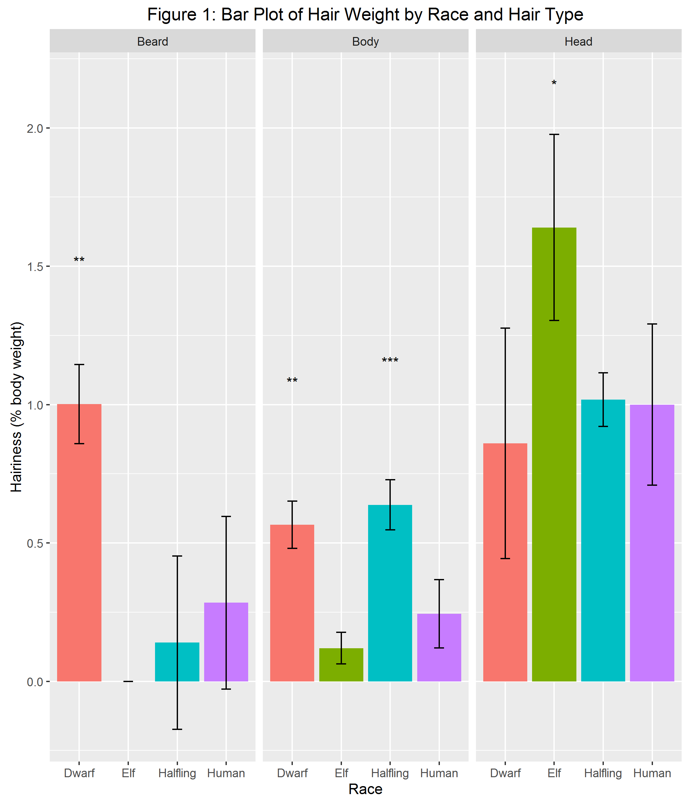
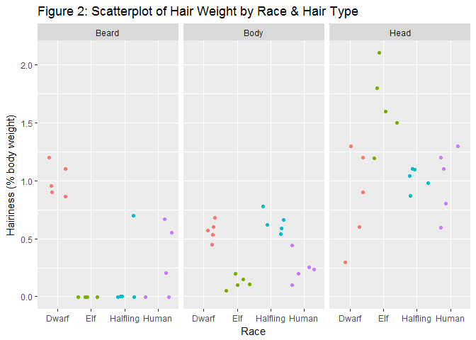

Homework 7 Report: Hair Trends in the Free Peoples
================
Katharine Sedivy-Haley
2016-12-05

### Introduction

Much has been made of the languid locks of the elves, the burly beards of the dwarves, and the furry feet of the halflings. Length and amount of hair can have both cultural and biological significance ([Pergament 1999](http://scholarship.kentlaw.iit.edu/cgi/viewcontent.cgi?article=3182&context=cklawreview), [Muscarella and Cunningham 1996](http://www.sciencedirect.com.ezproxy.library.ubc.ca/science/article/pii/0162309595001301)). However, as yet no studies have assessed the statistical validity behind common stereotypes. We here compare the amount of hair, relative to humans, possessed by elves, dwarves, and halflings in the head, beard, and body regions.

``` r
#reads external code so I can run it in later chunks
knitr::read_chunk('scatterplot.R')
```

``` r
library(tidyverse)
```

    ## Warning: package 'ggplot2' was built under R version 3.3.2

``` r
library(stringr)
library(knitr)

#this function is useful for translating lists to plain text
#c("x", "y") becomes "x and y"
#c("x", "y", "z") becomes "x, y, and z"

write_and <- function(x) {
  if(length(x)<2) return(x)
  if(length(x)==2) return(str_c(x[1], " and ", x[2], "."))
  if(length(x)>2) {
    return(str_c(paste(x[1:length(x)-1], collapse=", "), 
                 ", and ", x[length(x)]))
  }
}

# This is useful for getting the name (race and hair type) of a group
# with an interesting characteristic based on its index/row number.

write_name <- function(data, rnum){
  paste0(data$Race[rnum], " ", data$Type[rnum])
}

original_data <- read_csv("data.csv")
table1 <- kable(original_data)
```

### Methods

We recruited 5 male volunteers from each of the Human, Elven, Dwarven, and Halfling races. Volunteers were weighed and then shaved, with hair being separately collected from the head, beard, and remainder of the body. The hair collected from each site was weighed and the percentage of the original body weight represented by each hair sample was calculated. Raw data is displayed in Table 1.

#### Table 1

|  Human-Head|  Human-Beard|  Human-Body|  Elf-Head|  Elf-Beard|  Elf-Body|  Dwarf-Head|  Dwarf-Beard|  Dwarf-Body|  Halfling-Head|  Halfling-Beard|  Halfling-Body|
|-----------:|------------:|-----------:|---------:|----------:|---------:|-----------:|------------:|-----------:|--------------:|---------------:|--------------:|
|         1.2|         0.00|        0.20|       1.8|          0|      0.10|         1.2|         0.90|        0.60|           1.10|             0.0|           0.54|
|         0.6|         0.55|        0.25|       1.6|          0|      0.20|         0.9|         1.10|        0.45|           0.98|             0.0|           0.78|
|         0.8|         0.20|        0.10|       2.1|          0|      0.05|         1.3|         1.20|        0.68|           1.04|             0.0|           0.59|
|         1.1|         0.00|        0.23|       1.5|          0|      0.10|         0.3|         0.86|        0.53|           0.87|             0.7|           0.62|
|         1.3|         0.67|        0.44|       1.2|          0|      0.15|         0.6|         0.95|        0.57|           1.10|             0.0|           0.66|

Mean and standard deviation were determined and statistical analysis was performed using Student's T-Test with humans as the reference sample. Code used for this analysis can be found in the [supplemental materials online](https://github.com/STAT545-UBC/sedivy-haley_katharine/blob/master/hw07_Make/Analysis.R).

Ethical permissions were obtained from the MEFPERB (Middle Earth Free Peoples Ethical Review Board).

### Results & Discussion

``` r
# I read in my analysed table here, as well as picking out some interesting
# values to refer to in the text using `r variable_name` notation.

analysed_data <- read_csv("analysed_data.csv", na=character()) 
table2 <- analysed_data %>%
  arrange(Type) %>%
  kable(digits=3)

best_pval <- which.min(analysed_data$p.value)
best_pval_name <- write_name(analysed_data, best_pval)
best_pval_diff <- round(analysed_data[[best_pval, "diff"]], 2)
best_pval_pval <- round(analysed_data[[best_pval, "p.value"]], 3)

sig_dec <- analysed_data %>%
  filter(p.value <= 0.05 & diff<0) 
nrow(sig_dec)
```

    ## [1] 0

``` r
# I note sig_dec is empty so I get the values for the biggest decrease

biggest_dec <- which.min(analysed_data$diff)
dec_name <- write_name(analysed_data, biggest_dec)
dec_diff <- round(analysed_data[[biggest_dec, "diff"]], 2)
dec_pval <- round(analysed_data[[biggest_dec, "p.value"]], 3)

sig_inc <- analysed_data %>%
  filter(p.value <= 0.05 & diff>0)
nrow(sig_inc)
```

    ## [1] 4

``` r
# I note sig_inc is populated so I pull more info

#grabs the name for each group in sig_inc and passes it to write_and()
names_sig_inc <- write_and(sapply(seq(1, nrow(sig_inc)), 
                                  function (i) write_name(sig_inc, i)))

biggest_inc <- which.max(sig_inc$diff)
inc_name <- write_name(sig_inc, biggest_inc)
inc_diff <- round(sig_inc[[biggest_inc, "diff"]], 2)
inc_pval <- round(sig_inc[[biggest_inc, "p.value"]], 3)
```

A statistically significant (p &lt;= 0.05) increase in weight was found for Elf Head, Dwarf Beard, Dwarf Body, and Halfling Body hair. Of these, the biggest change was observed in Dwarf Beard hair, with a change of 0.72 % body weight from the human mean (p-value 0.004), confirming the popular conception. The most statistically significant change was observed in Halfling Body hair, with a change of 0.39 % body weight from the human mean (p-value 0.001). This change is likely due to the foot hair.

The greatest decrease was observed in Elf Beard hair, with a change of -0.28 % body weight from the human mean. However, this was not found to be statistically significant, with a p-value of only 0.111.

This data is summarised in Table 2 and Figure 1.

#### Table 2

| Race     | Type  |   mean|     sd|    diff|  p.value| p.star |
|:---------|:------|------:|------:|-------:|--------:|:-------|
| Human    | Beard |  0.284|  0.311|   0.000|    1.000|        |
| Elf      | Beard |  0.000|  0.000|  -0.284|    0.111|        |
| Dwarf    | Beard |  1.002|  0.143|   0.718|    0.004| \*\*   |
| Halfling | Beard |  0.140|  0.313|  -0.144|    0.487|        |
| Human    | Body  |  0.244|  0.124|   0.000|    1.000|        |
| Elf      | Body  |  0.120|  0.057|  -0.124|    0.091|        |
| Dwarf    | Body  |  0.566|  0.085|   0.322|    0.002| \*\*   |
| Halfling | Body  |  0.638|  0.091|   0.394|    0.001| \*\*\* |
| Human    | Head  |  1.000|  0.292|   0.000|    1.000|        |
| Elf      | Head  |  1.640|  0.336|   0.640|    0.013| \*     |
| Dwarf    | Head  |  0.860|  0.416|  -0.140|    0.557|        |
| Halfling | Head  |  1.018|  0.097|   0.018|    0.901|        |



The lack of statistically significant decreases in hair weight was surprising, since elves (and most halflings) are widely known to be incapable of growing beards, unlike humans and dwarves. However in Figure 1 we observe high standard deviations in beard height in particular, and examining the individual data points (Figure 2) we similarly note high variability between data points, with two human subjects notably being beardless. For our sample size of 5, this variability likely obscured the known biological differences between elves and humans in the realm of facial hair.

``` r
data <- read_csv("tidy_data.csv")

#check to make sure I've read in a tidy data frame
if(!is.data.frame(data)){
  stop(paste(c("analysed_data must be a data frame for graphing. Class", 
               class(df), "supplied."), collapse=" "))
}
cols_needed <- c("Race", "Type", "Hairiness")
cols_missing <- !(cols_needed %in% colnames(data))
if(sum(cols_missing) > 0){
  stop(paste(c("analysed_data is missing column(s)", 
               cols_needed[cols_missing]), collapse=" "))
}

ggplot(data, aes(x=Race, y=Hairiness, color=Race)) + 
  facet_wrap(~Type) +
  geom_jitter() +
  labs(title="Figure 2: Scatterplot of Hair Weight by Race & Hair Type", 
       y = "Hairiness (% body weight)") + 
  theme(legend.position="none")  #redundant with x-axis label
```



### Conclusions

Though significant increases were observed in Elf Head, Dwarf Beard, Dwarf Body, and Halfling Body hair weight, variation in hairiness obscured groups with sigificantly less hair in any regions. A larger sample size will be necessary for more statistical power. Additionally, more research is needed to disentangle the cultural and biological reasons for the results obtained.

Reflections
-----------

I essentially used the data analysis pipeline functions from [hw06](https://github.com/STAT545-UBC/sedivy-haley_katharine/blob/master/hw06_FunctionsNesting/hw06_FunctionsNesting.md) so that I could focus on Make, though I made some thematic changes to the data set analysed for entertainment purposes.

I found additional sources that were helpful in implementing the pdf function using [LaTeX with Markdown](http://tech.lauritz.me/easy-latex-with-markdown-pandoc/) and [code externalization](http://zevross.com/blog/2014/07/09/making-use-of-external-r-code-in-knitr-and-r-markdown/).

The LaTeX information was hardest to find, but once I located the above source it only required minor fiddling with the Makefile to make sure it could generate a .md if I didn't ask it to make report.html. I also notice that the pdf version removes the links and moves the figures around (presumably to fit on the page). I would like to see if I can explore the formatting a bit.

I did find it challenging to keep the list of dependencies straight in my head & updated, especially since the end report proved to be somewhat more complex than anticipated, drawing information from multiple stages of data analysis. If I were writing a real report I would probably want to simplify this.
